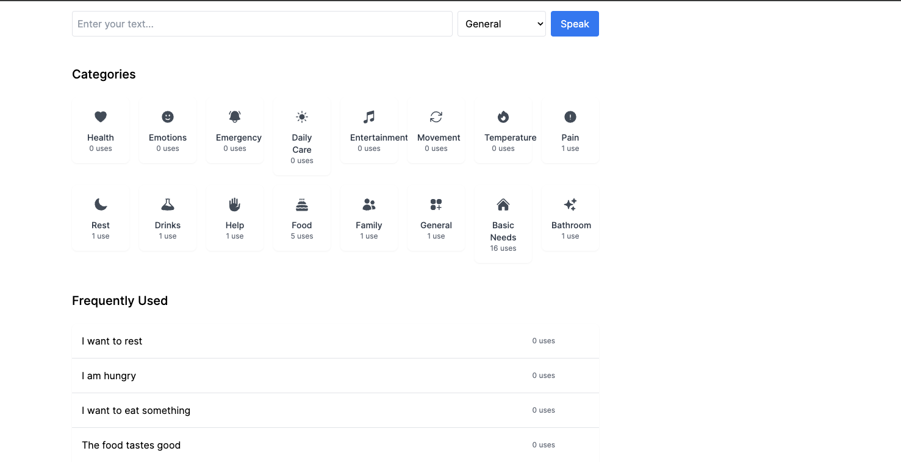
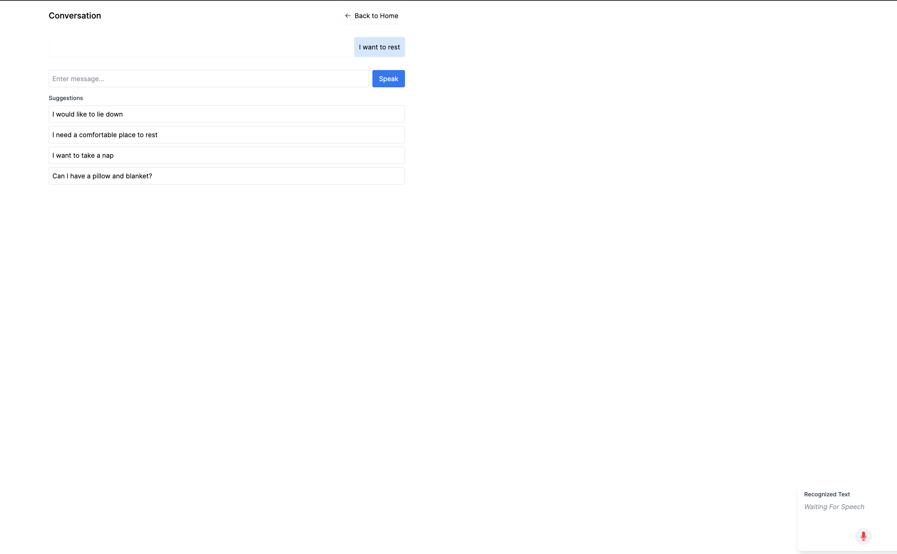

# Listen2Me

Listen2Me is an assistive communication application designed for people who are temporarily or permanently unable to speak, such as patients after tracheostomy or those with other conditions affecting speech capabilities.




> **Note**: This project is currently in early development and is being developed in our free time. We aim to create a free, open-source tool for people who need this type of assistance. We warmly welcome anyone who would like to contribute to this meaningful project!

## Quick Start with Docker

### Prerequisites
- Docker Desktop installed ([Download here](https://www.docker.com/products/docker-desktop/))
- Git installed ([Download here](https://git-scm.com/downloads))

### Installation Steps

1. Clone the repository:
   ```bash
   git clone https://github.com/stefan-kp/listen2me.git
   cd listen2me
   ```

   Optional: If not using Docker, copy the database config:
   ```bash
   cp config/database.yml.example config/database.yml
   ```

2. Start the application:
   ```bash
   docker compose up
   ```

3. Access the application:
   - Open your browser and go to http://localhost:80
   - Create a new account
   - IMPORTAN Add your API keys in the settings:
     - ElevenLabs API key for text-to-speech
     - Choose your preferred LLM provider (OpenAI, Anthropic, or Gemini) and add the API key

That's it! The application will automatically:
- Set up the database
- Install all dependencies
- Start the development server
- Initialize required data

> **Note**: The application uses Docker and PostgreSQL. The database configuration 
> is handled automatically through environment variables in docker-compose.yml - 
> no manual database configuration is needed.

### Stopping the Application
```bash
docker compose down
```